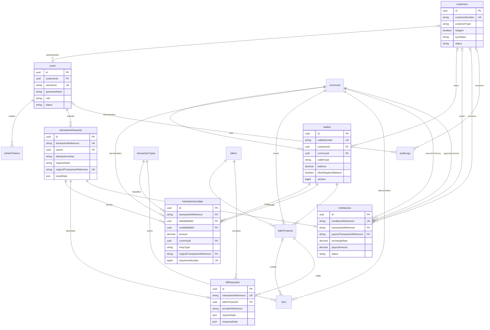
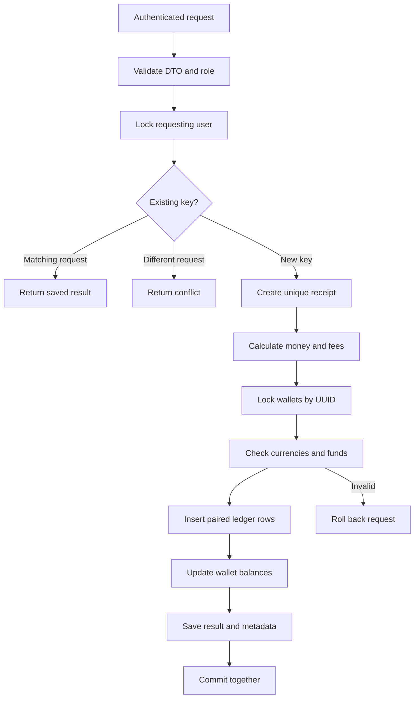
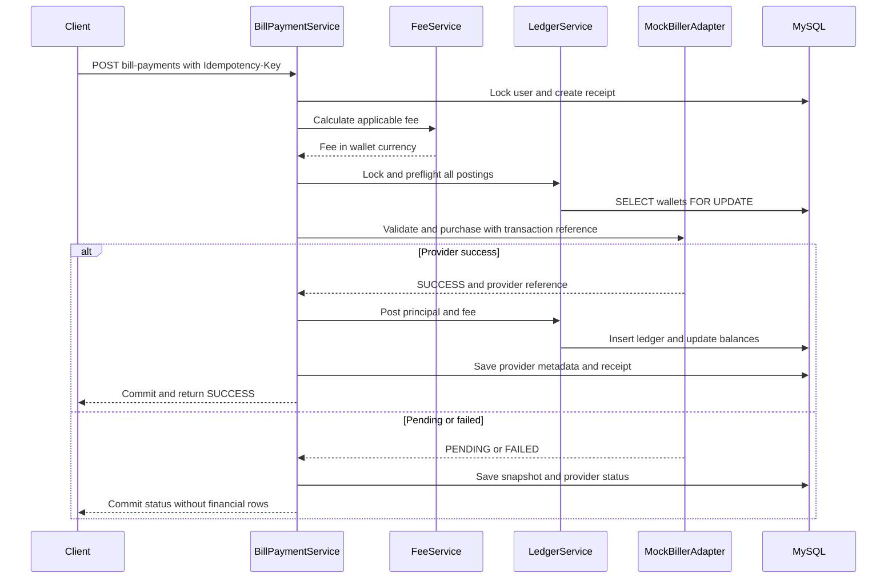

# Data model and transaction flows

The diagrams describe the implemented single application. Camel-case entity labels below map to the snake-case SQL tables. `transactionRequests` stores idempotency receipts and lifecycle coordination; it is not a financial ledger. Every movement is in `transactionsLedger`.

## Entity relationship diagram



## Transaction flow



## Bill payment sequence



## Agent discount sequence

```mermaid
sequenceDiagram
    participant agent as Agent
    participant service as BillPaymentService
    participant reward as RewardService
    participant provider as MockBillerAdapter
    participant ledger as LedgerService
    agent->>service: Buy face value USD 20 from USD 100 wallet
    service->>reward: DISCOUNT at 2 percent
    reward-->>service: Commission USD 0.40
    service->>ledger: Preflight USD 19.60 debit and USD 0.40 expense
    service->>provider: Purchase USD 20 face value
    provider-->>service: SUCCESS
    service->>ledger: Agent to biller USD 19.60 PRINCIPAL
    service->>ledger: Commission expense to biller USD 0.40 COMMISSION
    service-->>agent: Commit one reference; balance USD 80.40
```

The two posting arrows describe entries in one atomic `postBatch` call. Cashback instead posts USD 20 from agent to biller, then USD 0.40 from commission expense to agent. Any fee is an additional entry in the same batch.

## Remittance send sequence

```mermaid
sequenceDiagram
    participant client as Sender
    participant service as RemittanceService
    participant rates as ExchangeRateService
    participant ledger as LedgerService
    participant db as MySQL
    client->>service: Send amount and destination currency
    service->>db: Lock user and check idempotency receipt
    service->>rates: Get configured currency pair rate
    rates-->>service: Trusted rate
    service->>service: Calculate payout and send fee
    service->>ledger: Sender to source settlement plus fee
    ledger->>db: Lock wallets; insert entries; update balances
    service->>db: Save remittance AVAILABLE_FOR_PAYOUT
    service-->>client: Commit and return remittance reference
```

Payout locks the remittance, checks receiver identity and the target wallet, and debits the destination-currency settlement wallet. Source and destination currencies never coexist in a ledger row. Cross-currency destination settlement requires separate prefunding.

## Reversal sequence

```mermaid
sequenceDiagram
    participant operator as Operator
    participant service as ReversalService
    participant provider as MockBillerAdapter
    participant ledger as LedgerService
    participant db as MySQL
    operator->>service: Reverse original reference with new key
    service->>db: Lock user and original request
    service->>db: Check unique reversal and remittance lifecycle
    service->>ledger: Preflight original amounts with wallets swapped
    opt Bill payment
        service->>provider: Reverse using new and original references
        provider-->>service: SUCCESS
    end
    service->>ledger: Post all compensating entries in one batch
    ledger->>db: Insert REVERSAL rows; update balances
    service->>db: Link original reference and append audit
    service-->>operator: Commit new reference
```

Posted original rows retain `SUCCESS`; the transaction query derives `REVERSED` from the unique compensating request. Reversing a reversal is prohibited.
